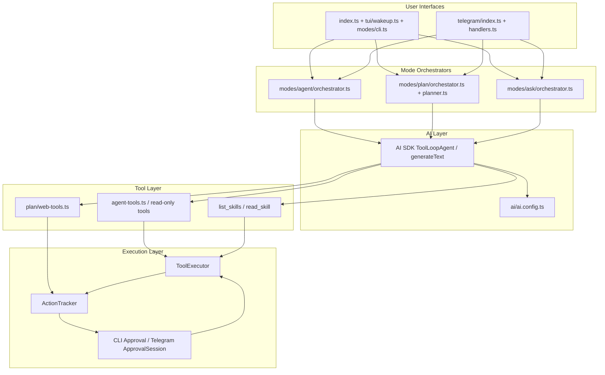
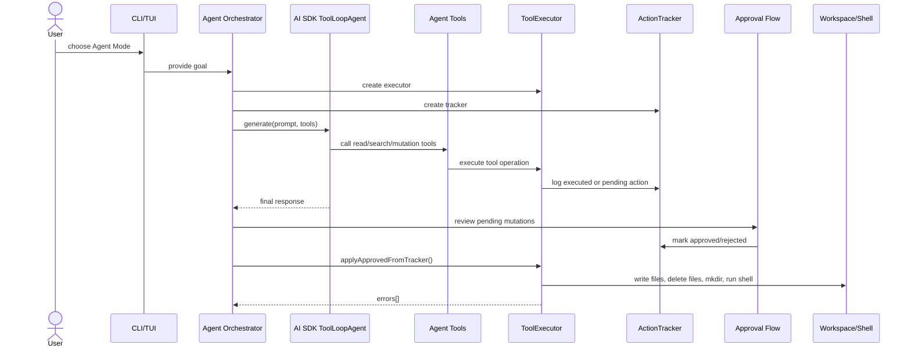
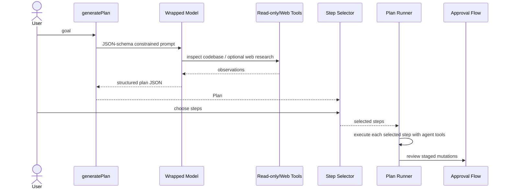
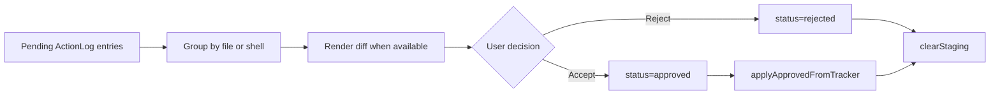
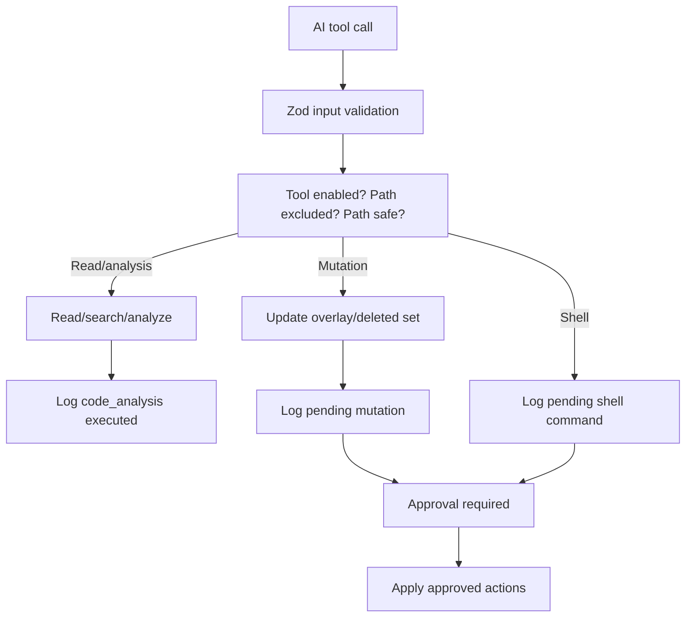
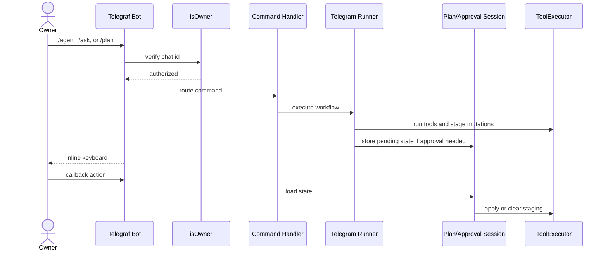

# Architecture

OPENCLAW Project is organized around mode-specific AI orchestration, shared tool
execution, and approval-gated mutation application. The design separates user
interfaces from agent behavior so the same core workflows can run in the local
CLI or through Telegram.

## High-level architecture

## Component responsibilities

### Entrypoints and routing

- `index.ts` defines the executable command `Mr.Jack` and registers the
  `wakeup` command.
- `tui/wakeup.ts` renders the banner, asks whether to run CLI or Telegram mode,
  and dispatches to the selected interface.
- `modes/cli.ts` loops over CLI sub-modes: Agent, Plan, and Ask.
- `telegram/index.ts` creates the Telegraf bot, registers handlers, sends the
  owner welcome message, and handles shutdown signals.

### Configuration and AI model

- `config/conf.ts` validates environment configuration with Zod.
- `ai/ai.config.ts` creates an OpenRouter provider and returns the configured
  model.
- `ai/index.ts` re-exports the model factory.

### Agent Mode

- `modes/agent/orchestrator.ts` prompts for a goal, creates the tracker,
  executor, tools, and `ToolLoopAgent`, then runs approval and application.
- `modes/agent/agent-tools.ts` exposes read, file mutation, folder creation,
  shell queueing, search, analysis, and skill tools.
- `modes/agent/tool-executor.ts` implements all workspace operations,
  in-memory staging, path safety checks, excluded path policy, and application
  of approved changes.
- `modes/agent/action-tracker.ts` stores audit entries for tool activity.
- `modes/agent/approval.ts` handles interactive CLI approval.
- `modes/agent/diff-view.ts` builds unified diffs for staged file changes.
- `modes/agent/types.ts` defines action and configuration types.

### Plan Mode

- `modes/plan/planner.ts` uses read-only tools and optional web tools to produce
  structured JSON matching the plan schema.
- `modes/plan/selection.ts` prints generated plans and lets users choose steps.
- `modes/plan/orchestator.ts` executes selected steps through agent tools and
  routes staged changes through approval.
- `modes/plan/web-tools.ts` provides Firecrawl search/crawl and generic fetch
  tools.
- `modes/plan/types.ts` defines `Plan` and `PlanStep`.

### Ask Mode

- `modes/ask/orchestrator.ts` creates a read-oriented agent for codebase
  questions, renders the answer, and optionally stages a Markdown answer file
  for approval.

### Telegram integration

- `telegram/handlers.ts` registers commands and callback actions.
- `telegram/auth.ts` allows only the configured owner ID.
- `telegram/agent-run.ts` adapts ask, agent, and plan execution to Telegram
  replies.
- `telegram/plan-session.ts` stores plan selections and renders inline
  keyboards.
- `telegram/approval-session.ts` stores pending approvals and renders accept,
  reject, and diff actions.
- `telegram/text.ts` clips long responses and formats Markdown replies.
- `telegram/constant.ts` contains the welcome text.

## Agent execution lifecycle

## Planning flow

## Approval workflow

Approvals are intentionally centralized around `ActionTracker` status updates.
Mutating tool calls create `pending` actions. Approval code changes those actions
to `approved` or `rejected`. The executor only applies approved mutations.

## Tool execution workflow

## Telegram integration flow

## Design decisions

### Approval-gated mutations

The project stages file and shell mutations rather than applying them directly.
This makes agent behavior inspectable and gives users a clear decision point
before destructive operations.

### Shared executor and tracker

`ToolExecutor` owns filesystem behavior while `ActionTracker` owns audit state.
This split keeps tools thin and allows CLI and Telegram approval workflows to
share the same execution semantics.

### Workspace-relative paths

Tool APIs accept relative paths. The executor resolves them against the current
workspace and rejects paths that escape the root. This reduces accidental writes
outside the intended project.

### Mode-specific tool capability

Agent Mode exposes mutating tools. Ask and planner flows use read-oriented tools
unless a user explicitly chooses to save an answer. This reduces risk in
question-answering and planning contexts.

### Structured planning output

Plan generation uses an output schema and JSON extraction middleware. This gives
Plan Mode stable `PlanStep` objects that can be selected in CLI and Telegram UI.

### Owner-only Telegram access

Telegram handlers check `TELEGRAM_OWNER_ID` before executing commands or
callbacks. This is a simple access-control model suitable for personal agent
usage.

## Known implementation considerations

- The plan orchestrator file is named `orchestator.ts` in the current codebase.
- Environment parsing currently requires all configured integration secrets at
  startup, even if a mode does not use every integration.
- Shell execution is supported by default in Agent Mode; production deployments
  should carefully review this policy.
