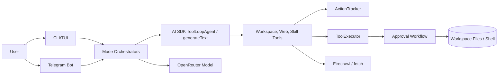

# OPENCLAW Project (Mr.Jack)

OPENCLAW Project is a TypeScript and Bun-based AI coding assistant named
**Mr.Jack**. It provides a Claude/Codex-style workflow for asking questions
about a codebase, generating implementation plans, executing agentic changes,
reviewing staged mutations, and operating the same workflows from a Telegram
bot.

The project is intentionally small and readable. It is a practical foundation
for building a local-first AI software engineering agent with approval gates,
action tracking, tool execution, web research, terminal rendering, and chat
integrations.

## Features

- **Agent Mode**: lets an AI agent inspect a workspace, stage file/folder/shell
  changes, and request approval before applying mutations.
- **Plan Mode**: generates a structured plan for a goal, lets the user select
  steps, and executes selected steps through the agent toolchain.
- **Ask Mode**: answers codebase questions using read-oriented tools and can
  save answers to Markdown after approval.
- **Approval workflows**: groups staged actions by file or shell command,
  displays diffs, and applies only approved operations.
- **Action tracking**: records reads, searches, analysis, file mutations, folder
  creation, and queued shell commands.
- **Tool execution sandboxing**: resolves paths against the workspace root and
  blocks path traversal outside the project.
- **OpenRouter-backed AI orchestration**: uses the AI SDK with an OpenRouter
  provider and configurable model name.
- **Telegram bot integration**: exposes `/ask`, `/agent`, and `/plan` commands
  with owner-only authorization and inline approval controls.
- **Web research tools**: integrates Firecrawl search, crawl, and URL fetching
  for planning and research workflows.
- **Terminal UI**: uses Clack prompts, Chalk styling, Figlet banners, and
  Markdown rendering for interactive CLI sessions.
- **Skill discovery**: can list and read `SKILL.md` files from configured local
  skill directories.

## Architecture overview

OPENCLAW has four primary layers:

1. **Entrypoints and UI**: `index.ts`, `tui/`, `modes/cli.ts`, and `telegram/`
   route users into CLI or Telegram workflows.
2. **Mode orchestrators**: `modes/agent/`, `modes/plan/`, and `modes/ask/`
   define the behavior for each interaction mode.
3. **AI and tools**: `ai/` configures the OpenRouter language model; tool
   factories expose workspace, web, and skill operations to AI SDK agents.
4. **Execution and approval**: `ActionTracker`, `ToolExecutor`, CLI approvals,
   and Telegram approval sessions stage, review, and apply mutations.



For a deeper explanation, see [ARCHITECTURE.md](ARCHITECTURE.md) and the
architecture documentation in [`docs/architecture/`](docs/architecture/).

## Installation

### Prerequisites

- [Bun](https://bun.sh/) 1.3 or later
- TypeScript 5-compatible tooling
- An OpenRouter API key
- A Firecrawl API key if you want web search/crawl tools
- A Telegram bot token and owner chat ID if you want Telegram mode

### Install dependencies

```bash
bun install
```

### Verify the project

```bash
bun run typecheck
bun run build
```

## Quick Start

1. Clone the repository.
2. Install dependencies with `bun install`.
3. Export the required environment variables.
4. Start the application.

```bash
export OPENROUTER_API_KEY="your-openrouter-key"
export OPENROUTER_DEFAULT_MODEL="openai/gpt-4o-mini"
export FIRECRAWL_API_KEY="your-firecrawl-key"
export TELEGRAM_BOT_TOKEN="your-telegram-bot-token"
export TELEGRAM_OWNER_ID="123456789"

bun run dev wakeup
```

The `wakeup` command opens the interactive launcher. Choose **CLI** for local
terminal workflows or **Telegram** to launch the bot.

## Configuration

Runtime configuration is parsed in `config/conf.ts` with Zod. The current
implementation reads values directly from `process.env` at startup.

| Setting | Required | Description |
| --- | --- | --- |
| `OPENROUTER_API_KEY` | Yes | API key used to create the OpenRouter provider. |
| `OPENROUTER_DEFAULT_MODEL` | No | Model identifier passed to OpenRouter. Defaults to `openrouter/free`. |
| `FIRECRAWL_API_KEY` | Yes | API key used by web search and crawl tools. |
| `TELEGRAM_BOT_TOKEN` | Yes | Token from BotFather for Telegram mode. |
| `TELEGRAM_OWNER_ID` | Yes | Telegram chat/user ID allowed to use bot commands. |
| `SKILLS_DIRS` | No | Semicolon-separated extra directories scanned for `SKILL.md` files. |

> **Note**: The current schema requires Firecrawl and Telegram variables even
> when you only run CLI mode. Set dummy values for unused integrations in local
> experiments, or update the schema if you need optional integrations.

## Environment Variables

Create a local `.env` file for your shell or process manager, but do not commit
it. Bun can also load environment variables from `.env` when invoked from the
project directory.

```bash
OPENROUTER_API_KEY=your-openrouter-key
OPENROUTER_DEFAULT_MODEL=openai/gpt-4o-mini
FIRECRAWL_API_KEY=your-firecrawl-key
TELEGRAM_BOT_TOKEN=your-telegram-bot-token
TELEGRAM_OWNER_ID=123456789
SKILLS_DIRS=/path/to/skills;/another/skills/root
```

## CLI Usage

### Show the launcher

```bash
bun run dev wakeup
```

or, after linking/installing the binary:

```bash
Mr.Jack wakeup
```

### CLI modes

- **Agent Mode**: describe a concrete codebase task. The agent may stage file,
  folder, or shell operations and then ask for approval before applying them.
- **Plan Mode**: describe a goal. The planner researches the codebase, generates
  steps, lets you select steps, and runs each selected step through an agent.
- **Ask Mode**: ask a question. The assistant reads/searches the codebase and
  can optionally save the answer to a Markdown file.

## Telegram Bot Usage

Start Telegram mode from the wakeup launcher and ensure `TELEGRAM_OWNER_ID`
matches your chat ID. The bot ignores commands from other users.

Supported commands:

| Command | Purpose |
| --- | --- |
| `/start` | Show the welcome message. |
| `/ask <question>` | Ask a read-oriented question about the codebase. |
| `/agent <task>` | Run Agent Mode from Telegram. |
| `/plan <goal>` | Generate a plan, toggle steps, and execute selected steps. |

Telegram approval controls include:

- **Show Diff**: sends a clipped diff for staged file changes.
- **Accept All**: marks staged mutations approved and applies them.
- **Reject All**: rejects staged mutations and clears staging.

## Agent Workflow

1. The user provides a goal.
2. The orchestrator creates an `ActionTracker`, `ToolExecutor`, and AI SDK
   `ToolLoopAgent`.
3. The agent calls tools to inspect files, search the workspace, stage changes,
   or queue shell commands.
4. Mutating tools write to an in-memory overlay and append pending actions to
   the tracker.
5. The approval flow groups pending actions, renders diffs, and asks the user
   to accept or reject changes.
6. Approved actions are applied to disk or executed in the workspace shell.
7. Staging state is cleared.

## Screenshots

Screenshots are not included yet because the repository does not currently ship
image assets. Recommended captures for future releases:

- CLI wakeup banner and mode picker
- Agent Mode approval prompt
- Plan Mode step selector
- Telegram plan selection keyboard
- Telegram approval message and diff response

## Development Setup

```bash
bun install
bun run typecheck
bun run build
bun run dev wakeup
```

Recommended development practices:

- Keep tool APIs small and typed with Zod schemas.
- Add approval gates for every mutating operation.
- Prefer read-only tools in Ask and planning contexts.
- Document new mode behavior in `docs/architecture/` and `docs/guides/`.
- Keep generated or temporary files out of the repository.

## Security Considerations

OPENCLAW is an AI agent that can stage file changes and queue shell commands.
Treat it as a privileged developer tool.

- Run it only in workspaces you intend to expose to the assistant.
- Review diffs and shell commands before accepting approvals.
- Keep `.env`, credentials, tokens, and private keys out of model-readable
  prompts whenever possible.
- Restrict Telegram access with `TELEGRAM_OWNER_ID` and protect the bot token.
- Consider disabling shell execution in custom configurations for lower-risk
  deployments.

See [SECURITY.md](SECURITY.md) for the full security policy.

## Roadmap

See [ROADMAP.md](ROADMAP.md). Near-term priorities include optional integration
configuration, stronger approval granularity, persistent audit logs, test
coverage, Docker images, and richer Telegram session management.

## FAQ

### What is the project entrypoint?

`index.ts` defines the `Mr.Jack` CLI and currently registers the `wakeup`
command.

### Does the agent write files immediately?

No. File creation, modification, deletion, folder creation, and shell commands
are staged first. They are applied only after approval.

### Can Ask Mode modify files?

Ask Mode uses read-oriented AI tools for answering questions. If the user asks
to save the answer, it stages a Markdown file and routes that through the same
approval flow.

### Can I use a different model?

Yes. Set `OPENROUTER_DEFAULT_MODEL` to any model ID supported by your
OpenRouter account.

### Does Telegram support multiple users?

The implementation is owner-only. Commands are ignored unless the chat ID
matches `TELEGRAM_OWNER_ID`.

## Troubleshooting

### Startup fails with environment variable errors

Ensure all required variables are set. The current Zod schema requires
OpenRouter, Firecrawl, and Telegram values at startup.

### Telegram commands do nothing

Verify that `TELEGRAM_OWNER_ID` exactly matches your Telegram chat ID. The bot
silently ignores unauthorized users.

### Web tools fail

Check `FIRECRAWL_API_KEY`, network access, and Firecrawl account limits. The
planner only enables web tools when a Firecrawl key is present.

### Tool execution cannot read or write a path

The executor blocks paths that escape the workspace and excludes configured
patterns such as `node_modules`, `.git`, `dist`, `.env`, `.next`, and `.log`.

### Plan Mode stops earlier than expected

Plan execution currently prints model output during step execution. If you are
extending Plan Mode, review the orchestrator control flow carefully and add
tests around multi-step execution.

## License

No explicit license file is currently present. Add a `LICENSE` file before
publishing this repository as open source. Until a license is added, all rights
are reserved by the repository owner.
