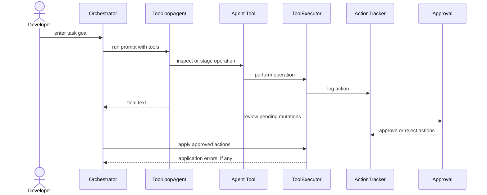

# Agent Mode

Agent Mode is the most capable workflow in OPENCLAW. It lets the model inspect a
workspace, stage file changes, create folders, delete files, and queue shell
commands. Every mutating operation requires approval before application.

## Core modules

| Module | Responsibility |
| --- | --- |
| `modes/agent/orchestrator.ts` | Runs the interactive Agent Mode lifecycle. |
| `modes/agent/agent-tools.ts` | Creates AI SDK tools for the executor. |
| `modes/agent/tool-executor.ts` | Implements reads, searches, staging, and application. |
| `modes/agent/action-tracker.ts` | Records executed and pending actions. |
| `modes/agent/approval.ts` | Provides CLI approval and diff review. |
| `modes/agent/diff-view.ts` | Creates unified diffs for staged file changes. |
| `modes/agent/types.ts` | Defines action and configuration types. |

## Tool set

Agent Mode exposes these tools:

- `read_file`
- `create_file`
- `modify_file`
- `delete_file`
- `create_folder`
- `list_files`
- `search_files`
- `analyze_codebase`
- `execute_shell`
- `list_skills`
- `read_skill`

## Lifecycle

## Staged file behavior

The executor maintains an overlay so multiple model edits can compose before any
write touches disk. Reads through `getEffectiveText()` see staged changes first,
then the underlying file, unless the file is staged for deletion.

## Shell command behavior

`execute_shell` does not run immediately. It creates a pending `tool_execute`
action. Approved shell commands run with `spawnSync` using `shell: true` and the
workspace root as `cwd`.

## Safety properties

- Workspace path traversal is rejected.
- Excluded paths are blocked by policy.
- Mutating tools log `pending` actions.
- Approval updates action status before application.
- Only approved actions are applied.
