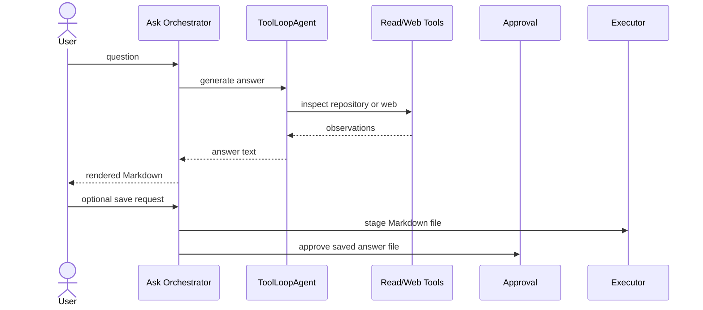

# Ask Mode

Ask Mode is optimized for codebase question answering. It uses a read-oriented
toolset, renders the answer in the terminal, and optionally stages a Markdown
file containing the answer.

## Core module

`modes/ask/orchestrator.ts` owns the Ask Mode CLI workflow.

## Tool set

Ask Mode exposes:

- `read_file`
- `list_files`
- `search_files`
- `analyze_codebase`
- `list_skills`
- `read_skill`
- Web tools from `createWebTools()`

The Ask Mode configuration disables file modification, folder creation, and
shell execution. Saving an answer is handled explicitly by the orchestrator and
routed through the approval flow.

## Flow

## Saved answer format

When a user saves an answer, Ask Mode writes a Markdown document with:

- `# Ask Mode`
- `## Question`
- `## Answer`

The file name must end in `.md` and cannot include path separators or `..`.
