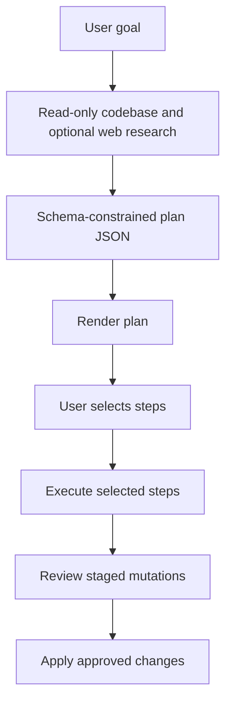

# Plan Mode

Plan Mode separates planning from execution. It first asks the model to produce a
structured plan, lets the user choose which steps to run, and then executes the
selected steps through the same approval-gated agent toolchain.

## Core modules

| Module | Responsibility |
| --- | --- |
| `modes/plan/planner.ts` | Generates a schema-validated plan. |
| `modes/plan/selection.ts` | Displays plans and collects selected steps. |
| `modes/plan/orchestator.ts` | Executes selected steps and invokes approval. |
| `modes/plan/web-tools.ts` | Provides web search, crawl, and fetch tools. |
| `modes/plan/types.ts` | Defines `Plan` and `PlanStep`. |

## Planning schema

A generated plan contains:

- `goal`: the original user goal.
- `researchSummary`: optional context found during research.
- `steps`: one to fifteen steps, each with title, description, optional hints,
  and optional complexity.

## Flow

## Read-only planning tools

During plan generation, the model can inspect the codebase with read-only tools:

- `read_file`
- `list_files`
- `search_files`
- `analyze_codebase`
- `list_skills`
- `read_skill`

When `FIRECRAWL_API_KEY` is configured, it can also use:

- `web_search`
- `web_crawl`
- `fetch_url`

## Execution tools

Selected steps are executed with Agent Mode tools. This means file and shell
operations are still staged and reviewed before application.

## Implementation notes

The current plan runner file is named `orchestator.ts`. Contributors should
preserve imports or rename the file in a dedicated refactor.
