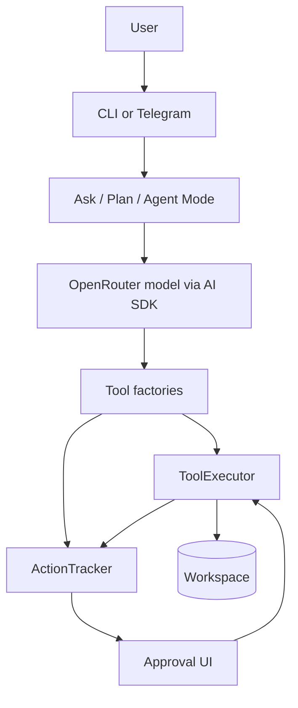

# System Overview

OPENCLAW Project is a local AI engineering assistant with CLI and Telegram
interfaces. Its core design is based on mode-specific orchestrators, shared AI
tooling, action tracking, and approval-gated execution.

## Goals

- Help developers ask questions about a repository.
- Generate implementation plans before changing code.
- Stage codebase changes through an AI agent.
- Require human approval before applying file, folder, or shell mutations.
- Provide a Telegram interface for remote, owner-only workflows.

## Runtime layers

## Entry points

- `index.ts` registers the `Mr.Jack` command and the `wakeup` subcommand.
- `tui/wakeup.ts` presents the launcher.
- `modes/cli.ts` routes CLI users to Agent, Plan, or Ask Mode.
- `telegram/index.ts` starts a Telegraf bot and registers Telegram handlers.

## Shared services

| Service | Responsibility |
| --- | --- |
| `getAgentModel()` | Creates the OpenRouter-backed language model. |
| `ActionTracker` | Stores tool activity and mutation statuses. |
| `ToolExecutor` | Reads, searches, stages, and applies workspace operations. |
| `renderTerminalMarkdown()` | Renders model Markdown in the terminal. |
| `createWebTools()` | Adds Firecrawl and fetch-based web research tools. |

## Workspace policy

The executor resolves tool paths relative to `process.cwd()`. It rejects paths
that escape the workspace root and skips configured excluded patterns, including
`node_modules`, `.git`, `dist`, `.env`, `.next`, and `.log`.

## Mutation model

Mutations are staged, not applied immediately. The staging model includes:

- An in-memory overlay for file creations and modifications.
- A deleted-file set for staged deletions.
- Pending `ActionLog` entries for file, folder, and shell operations.
- Approval status updates before application.

## External dependencies

- **OpenRouter**: model provider for AI SDK calls.
- **Firecrawl**: web search and crawl support.
- **Telegram**: remote bot interface through Telegraf.
- **Bun**: runtime, package manager, and build target.
