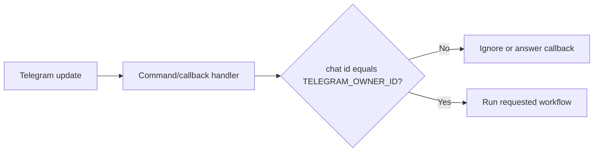

# Telegram Integration

The Telegram integration exposes core OPENCLAW workflows through a Telegraf bot.
It is designed for single-owner operation and rejects commands from other chat
IDs.

## Core modules

| Module | Responsibility |
| --- | --- |
| `telegram/index.ts` | Starts and stops the bot. |
| `telegram/handlers.ts` | Registers commands and callback handlers. |
| `telegram/auth.ts` | Checks the configured owner ID. |
| `telegram/agent-run.ts` | Runs Ask, Agent, and Plan steps for Telegram. |
| `telegram/plan-session.ts` | Stores selected plan state and renders keyboards. |
| `telegram/approval-session.ts` | Stores pending approvals and renders approval UI. |
| `telegram/text.ts` | Clips responses and sends Markdown replies. |
| `telegram/constant.ts` | Defines the welcome message. |

## Commands

| Command | Description |
| --- | --- |
| `/start` | Sends the welcome message. |
| `/ask <question>` | Runs read-oriented Ask workflow. |
| `/agent <task>` | Runs Agent Mode and prompts for approval if needed. |
| `/plan <goal>` | Generates selectable plan steps and executes selected steps. |

## Authorization flow

## Plan sessions

Plan sessions are stored in memory by chat ID. Each session contains:

- The generated `Plan`.
- A `Set<string>` of selected step IDs.

Inline keyboard callbacks toggle individual steps, select all, deselect all, or
proceed with execution.

## Approval sessions

Approval sessions are stored in memory by chat ID. Each session contains:

- The `ActionTracker`.
- The `ToolExecutor`.
- The pending actions captured after agent execution.

Callbacks can show a clipped diff, accept all changes, or reject all changes.

## Operational considerations

- Sessions are in memory and are lost when the process restarts.
- Telegram message length is clipped to avoid platform limits.
- Diffs sent over Telegram may contain sensitive source code.
- The bot uses long polling through `bot.launch()`.
